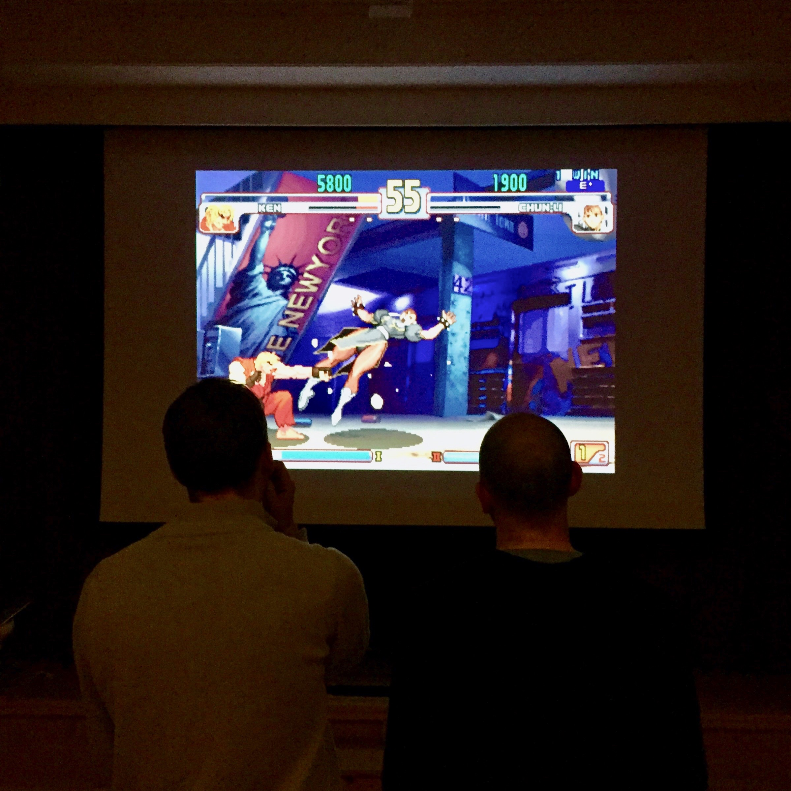

# Street fighter arcade

Here are some things I learned building a simple arcade [based on retropie](https://retropie.org.uk)

## Resources
- The retropie setup is documented well in their wiki https://github.com/retropie/RetroPie-Setup/wiki
- Write retropie image to your SD card with https://etcher.io/
- A lot of detailed thoughts on building arcade cabinets http://slagcoin.com/joystick/introduction.html
- Button template https://www.jammaboards.com/guides/Capcom_2P-6B_Template.gif

## Let's go shopping
- 1 Raspberry Pi (Model 3 works very well) https://www.digitec.ch/de/s1/product/raspberry-pi-3-model-b-armv8-entwicklungsboards-kits-5704269
- 16 Sanwa Buttons https://www.arcadeworlduk.com/products/Sanwa-OBSF-30-Arcade-Button.html
- 2 Sanwa Joysticks https://www.arcadeworlduk.com/products/Sanwa-JLF-TP-8YT-Ball-Top-Joystick.html
- HDMI Monitor and cable
- Wood and screws for the cabinet
